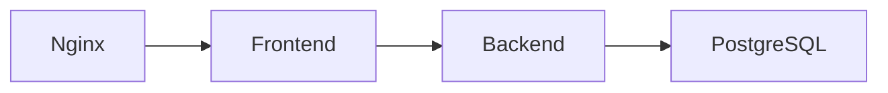

# Projeto: Docker Compose Guess Game

## Sumário
1. [Descrição da Aplicação](#descrição-da-aplicação)
2. [Estrutura de Containers](#estrutura-de-containers)
    - [Arquitetura dos componentes](#arquitetura-dos-componentes)
3. [Boas Práticas Adotadas](#boas-práticas-adotadas)
4. [Atualizar componentes](#atualizar-componentes)
5. [Escalabilidade](#escalabilidade)
6. [Requisitos](#requisitos)
7. [Instruções de Instalação e Execução](#instruções-de-instalação-e-execução)
    - [1. Clonar o repositório](#1-clonar-o-repositório)
    - [2. Navegar até o diretório do projeto](#2-navegar-até-o-diretório-do-projeto)
    - [3. Construir e iniciar os containers](#3-construir-e-iniciar-os-containers)
    - [4. Acessar a aplicação](#4-acessar-a-aplicação)
8. [Como Limpar o Projeto](#como-limpar-o-projeto)
## Descrição da Aplicação

Este projeto é uma prática de orquestração do projeto [GuessGame](https://github.com/fams/guess_game), onde os jogadores tentam adivinhar uma palavra secreta. A aplicação consiste em um frontend desenvolvido em React, que se comunica com um backend em Node.js, responsável pela lógica do jogo e pela persistência dos dados em um banco de dados PostgreSQL. A proposta desse exercício é colocar em prática boas práticas de containerização e orquestração.

## Estrutura de Containers

O ambiente é estruturado utilizando Docker e Docker Compose, com os seguintes serviços:

- **Nginx**: Serve o frontend e atua como proxy reverso, redirecionando as requisições para o backend. Também atua como loadbalancer para o caso de instancia de múltiplos backends.
- **Frontend**: A aplicação React que permite a interação do usuário.
- **Backend**: A API em Node.js que processa as lógicas do jogo e gerencia a comunicação com o banco de dados.
- **PostgreSQL**: O banco de dados que armazena informações do jogo, como usuários e palavras.

### Arquitetura dos componentes



## Boas Práticas Adotadas
- Uso de Docker e Docker Compose: Todos os serviços são containerizados, garantindo consistência e isolamento entre os ambientes.
- Proxy Reverso com Nginx: O Nginx atua como proxy reverso, servindo o frontend e redirecionando as requisições para o backend. Isso oferece mais flexibilidade e segurança para o gerenciamento do tráfego.
- Separação de serviços: A aplicação foi estruturada para que o frontend, backend e banco de dados PostgreSQL sejam independentes, facilitando manutenção e escalabilidade.
- Persistência de dados: O banco de dados PostgreSQL possui volumes configurados para garantir a persistência dos dados.
- Segregação de redes: O front e o back compartilham uma rede de aplicação, enquanto o banco de dados está em uma rede separada, cujo acesso é restrito ao backend, melhorando a segurança da aplicação.

## Atualizar componentes

Atualizar um dos componentes da estrutura é simples. Você pode modificar o Dockerfile ou os arquivos do serviço específico e usar o comando:

```bash
docker-compose up --build
```

## Escalabilidade 
O backend pode ser facilmente escalado para lidar com um maior número de requisições. Para isso, basta ajustar o número de réplicas do serviço de backend no arquivo docker-compose.yml. Por exemplo, para escalar o backend, basta adicionar:

```yaml
backend:
  build:
    context: .
  restart: always
  depends_on:
    - db
  deploy:
    replicas: n
```
Onde `n` é o número de réplicas desejado.

## Requisitos

Para executar este projeto, você precisará ter os seguintes softwares instalados:

- [Docker](https://docs.docker.com/engine/install/): Para criar e gerenciar os containers.
- [Docker Compose](https://docs.docker.com/compose/install/): Para orquestrar os containers.
- [Git](https://git-scm.com/book/en/v2/Getting-Started-Installing-Git): Para clonar o repositório do projeto.


## Instruções de Instalação e Execução

### 1. Clonar o repositório

```shell
git clone https://github.com/kimidomaru/docker_practice.git
```

### 2. Navegar até o diretório do projeto

```shell
cd docker_practice
```

### 3. Construir e iniciar os containers

```shell
docker-compose up --build
```

### 4. Acessar a aplicação

Abra o navegador e acesse [http://localhost](http://localhost) para interagir com a aplicação.

## Como Limpar o Projeto
Para limpar o projeto e remover os containers, volumes e redes criados pelo Docker Compose, siga os passos abaixo:

1. Parar e remover os containers
```bash
docker-compose down
```

2. Remover volumes associados
```
docker-compose down -v
```